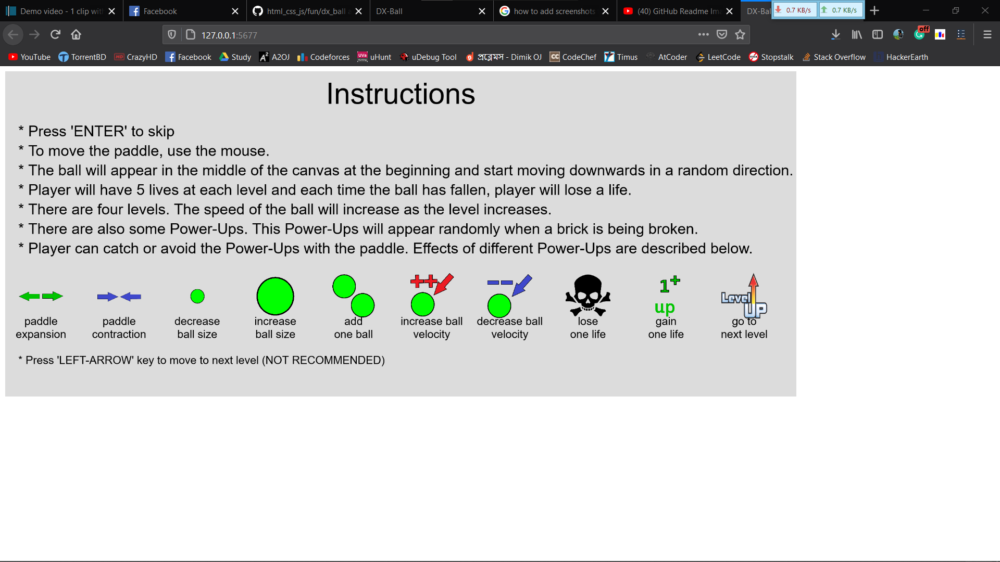
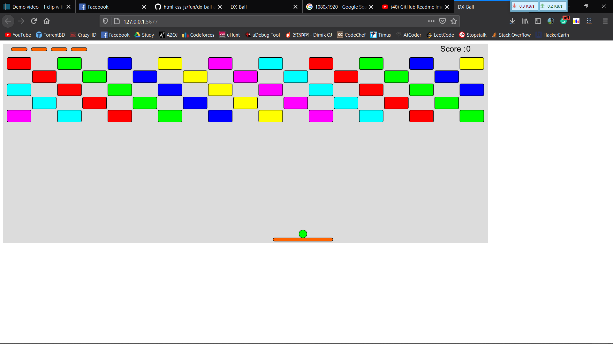
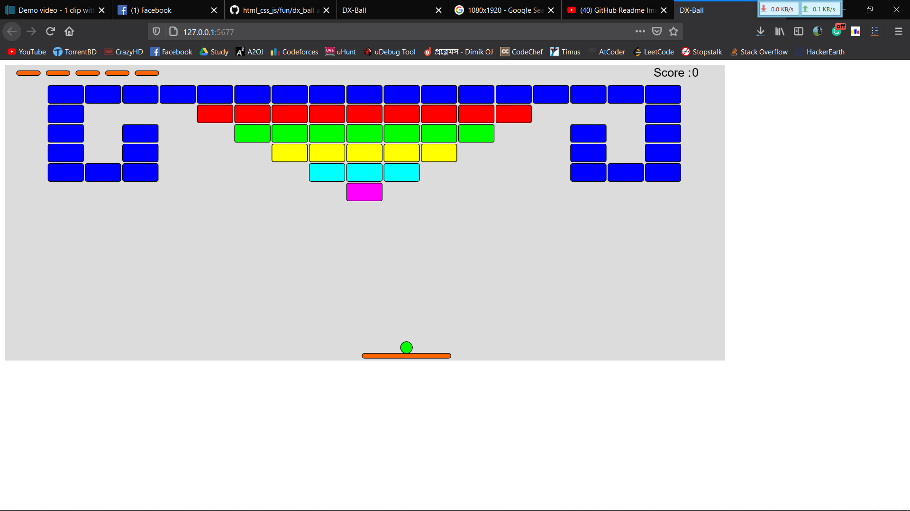
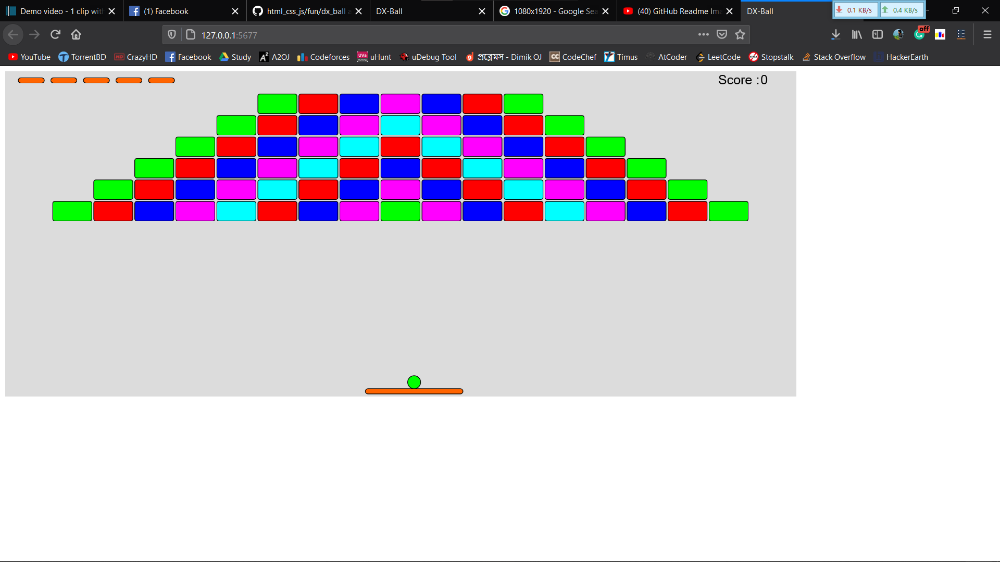
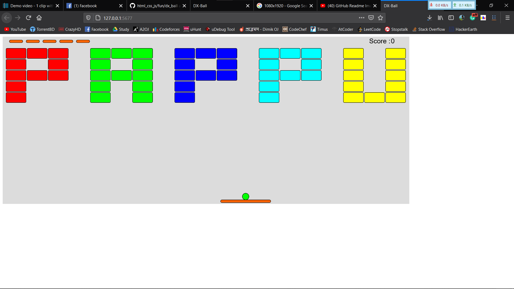

# Breakout Clone

## About The Project

[DX-Ball](https://en.wikipedia.org/wiki/DX-Ball) is basically a [Breakout](<https://en.wikipedia.org/wiki/Breakout_(video_game)>) clone: the player controls a paddle at the bottom and deflects a single ball, hitting different colored blocks on the top of the screen without having the ball fall below the screen. Clearing all the blocks results in completing the level and going to the next.

### Built With

-   [p5js](https://p5js.org/)

### Clone the repo

To get a local copy on your machine

```sh
git clone https://github.com/ehsanul-karim-pappu/html_css_js.git
```

## Gameplay

-   To move the paddle, use the mouse.
-   The ball will appear in the middle of the canvas at the beginning and start moving downwards in a random direction.
-   Player will have 5 lives at each level and each time the ball has fallen, player will lose a life.
-   There are four levels. The speed of the ball will increase as the level increases.
-   There are also some Power-Ups. This Power-Ups will appear randomly when a brick is being broken.
-   Player can catch or avoid the Power-Ups with the paddle.


### Screenshots







## Contact

Khandaker Ehsanul Karim

[Email](ehsan.pappu.99@gmail.com)  
[linkedIn](https://www.linkedin.com/in/ehsanul-karim-174b91136/)  
[Facebook](https://www.facebook.com/ehsanulkarimpappu)  
[github](https://github.com/ehsanul-karim-pappu/)

Project Link: [https://github.com/ehsanul-karim-pappu/html_css_js/fun/dx_ball](https://github.com/ehsanul-karim-pappu/html_css_js/fun/dx_ball)
